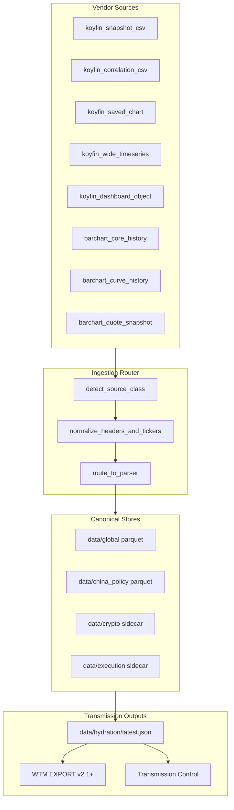

# WTM Data Architecture Build Plan

**Version:** 1.0.0 (architecture) · **Master Data Dictionary v1.0 Locked** (June 29, 2026)  
**Date:** June 29, 2026  
**Owners:** BUILD Cousins (Integration Dynamo + Bridge + Clarity)  
**Status:** Phase 1 naming locked — implementation continues  
**Machine registry:** [`whinfell_pipeline/data_dictionary.yaml`](../whinfell_pipeline/data_dictionary.yaml)  
**Human authority:** [`Master_Data_Dictionary_v1.0.md`](Master_Data_Dictionary_v1.0.md)  
**Loader:** [`whinfell_pipeline/data_dictionary.py`](../whinfell_pipeline/data_dictionary.py)

---

## Executive summary

Source-confirmation work across **Koyfin** and **Barchart** is complete. WTM is moving from ad hoc multi-source exports into a **canonical, source-aware, automation-ready** data system.

**Operating principle:** Less duplication · clearer ownership · stable canonical names · deterministic ingestion routing · cleaner transmission outputs.

**Already shipped (foundation):**
- Crypto sleeve first-class support ([`crypto_sleeve.py`](../whinfell_pipeline/crypto_sleeve.py))
- Koyfin header normalization + correlation parsing
- Raw→WTM transform on stage (2.2e)
- Hydration `crypto_sleeve` block
- Data dictionary YAML v1.0.0

**This plan:** Extend that foundation across all asset classes, split Barchart core vs curves, formalize Koyfin export classes, and align human + agent + transmission layers.

---

## 1. Revised source architecture (Koyfin + Barchart)

### 1.1 Layer model



### 1.2 Koyfin export classes

| Class | ID | Example file | Parser | Primary use |
|-------|-----|--------------|--------|-------------|
| Snapshot / watchlist | `koyfin_snapshot_csv` | `koyfin_WhinPump*.csv` | `parse_snapshot_rows` | Cross-section validation, universe membership |
| Historical correlation | `koyfin_correlation_csv` | `koyfin_2026-06-28-3.csv` | `parse_correlation_series` | Dated pairwise correl series |
| Saved chart | `koyfin_saved_chart` | `btc_price_chart_*.csv` | `parse_chart_timeseries` | Primary crypto price/correl history |
| Wide time-series | `koyfin_wide_timeseries` | `koyfin_YYYY-MM-DD.csv` | `koyfin_wide_timeseries` | **Backup** macro panel + global score proxy |
| Dashboard object | `koyfin_dashboard_object` | WTM-Global-Rates, WTM-Rates-Credit | Navigation only → exports above | Operator navigation, not a parser |

**Routing rule:** Chart > snapshot for current-state crypto; chart > wide for history; correlation CSV is never mixed with snapshot parser.

### 1.3 Barchart export classes

| Class | ID | Universe | Primary use |
|-------|-----|----------|-------------|
| Core history | `barchart_core_history` | 16-symbol core set | Always-on historical quotes |
| Curve history | `barchart_curve_history` | Curves + spreads | Term structure, basis, ladder |
| Quote snapshot | `barchart_quote_snapshot` | Screen exports | L3 execution hints |

**Critical decision:** Raw dense Barchart watchlists are **not** canonical import universe. Only `barchart_core` and explicit curve exports ingest automatically.

### 1.4 Priority order (per asset class)

| Data need | 1st choice | 2nd choice | Deprecated |
|-----------|------------|------------|------------|
| Crypto spot snapshot | WhinPump / WTM-Import-Core | — | BTCPRice object |
| Crypto price history | WTM-Crypto-Price chart | Wide timeseries BTCUSD Close | — |
| Crypto correl history | Per-asset correl charts | Wide timeseries correl cols | — |
| Credit pairwise correl | `koyfin_correlation_csv` | Wide timeseries correl cols | — |
| BTC basis / L3 | `barchart_curve_history` | — | — |
| Global transmission score | Parquet (post adapter) | Wide/snapshot heuristics | Raw watchlist scoring |

---

## 2. Revised canonical universe design

### 2.1 Koyfin watchlist tiers

| Watchlist | Role | Status |
|-----------|------|--------|
| **WTM-Import-Core** | Canonical cross-section import universe | **Planned** — Clark to create in Koyfin |
| **WTM-Import-Curves** | Curve proxy symbols for ladder context | Planned |
| **WTM-Research-Sandbox** | Exploratory only — never auto-ingested | Planned |
| WhinPump (current) | Interim proxy for core + crypto snapshot | Active until WTM-Import-Core ships |

**WTM-Import-Core** should include (minimum):  
`BTCUSD`, `ETHUSD`, `XRPUSD`, `SOLUSD`, `HYG`, `JAAA`, `BKLN`, `CWB`, `CBON`, `KHYB`, `SPY`, `QQQ`, `XLRE`, `SOFR`, `GC1`, `HG1`

### 2.2 Barchart core universe (always-on)

```
^BTCUSD  ^ETHUSD  ^XRPUSD  ^SOLUSD
IBIT     GBTC     SOFR
$HSI     $VHSI    $VXHY
CBON     KHYB     ASHR
DXY00    GCY00    HGY00
```

### 2.3 Barchart curve universe (curve-only)

FX futures · metals curves · energy curves · BTC futures curves · SOFR curves · rates strips · HY contracts · structured spreads (`_S_IV_*`, `_S_RT_*`, `_S_BF_*`).

**Not in daily core chain.** Used for basis ladder, term-structure research, and optional L3 enrichment.

---

## 3. Revised data dictionary structure

**Authority file:** [`whinfell_pipeline/data_dictionary.yaml`](../whinfell_pipeline/data_dictionary.yaml)

### 3.1 Sections

| Section | Purpose |
|---------|---------|
| `source_systems` | Vendor class definitions + detect rules + parser refs + output kinds |
| `canonical_assets` | Stable internal IDs + per-vendor ticker map |
| `field_mappings` | Raw header → snake_case (snapshot, correlation, barchart, curve) |
| `universes` | Koyfin watchlist tiers + Barchart core/curves symbol lists |
| `legacy_aliases` | BTCPRice etc. — alias-only, never primary |
| `classification` | source_of_truth · alias_only · deprecated · curve_only |
| `transmission_outputs` | Hydration bundle blocks + output kind taxonomy |

### 3.2 Canonical asset ID examples

| Canonical ID | Koyfin | Barchart | Class |
|--------------|--------|----------|-------|
| `btc_spot_usd` | BTCUSD | ^BTCUSD | crypto_spot |
| `eth_spot_usd` | ETHUSD | ^ETHUSD | crypto_spot |
| `btc_vehicle_ibit` | IBIT | IBIT | crypto_vehicle |
| `hyg` | HYG | — | credit_etf |
| `gold_continuous` | — | GCY00 | commodity_futures |
| `gold_front_or_cont_proxy` | GC1 | GCY00 | commodity_futures |
| `dxy_continuous` | — | DXY00 | fx_futures |

### 3.3 Implementation phases for dictionary

| Phase | Work | Owner |
|-------|------|-------|
| **P0** | YAML v1.0.0 + loader | Shipped |
| **P1** | `source_router.py` — single `route_ingest(path)` using dictionary detect rules | Integration Dynamo |
| **P2** | Fold `crypto_sleeve` maps into dictionary; deprecate duplicate constants | Integration Dynamo |
| **P3** | Barchart core symbol resolver + API historical loader | Integration Dynamo |
| **P4** | TC import panel shows `source_class` + `canonical_asset_id` in provenance | Visual Vanguard |

---

## 4. Revised human workflow

### 4.1 Daily operator chain (unchanged skeleton, clarified sources)

1. Export **batch screens** to `~/Downloads/whinfell_drop` (not Downloads root).
2. Run `scripts/normalize_whinfell_drop.sh` if filenames are raw vendor names.
3. Run `python3 run_batch_collect.py run --window today`.
4. Import `data/hydration/latest.json` in Transmission Control.

### 4.2 What Clark maintains (human-owned)

| Artifact | When to edit | Owner |
|----------|--------------|-------|
| **WTM-Import-Core** Koyfin watchlist | When WTM operating universe changes | Clark |
| **WTM-Import-Curves** | When ladder basis proxies change | Clark |
| **Saved charts** (WTM-Crypto-Price, correl charts) | When chart definition changes | Clark |
| **Dashboards** (WTM-Global-Rates, WTM-Rates-Credit) | Panel layout only — export class unchanged | Clark |
| **Barchart core list** | Rare — update `data_dictionary.yaml` + manifest | Clark + BUILD |
| **Barchart curve lists** | When roll calendar advances | Clark (quarterly) |
| **desk_urls.yaml** wired URLs | Paste Koyfin share links over REPLACE_ME | Clark |

### 4.3 Export type cheat sheet

| You exported… | File class | Canonical rename | Auto-routes to |
|---------------|------------|------------------|----------------|
| WhinPump / credit watchlist | Snapshot | `credit_YYYYMMDD_HHMM.csv` | Global score + **crypto snapshot** |
| `koyfin_2026-06-28-3.csv` | Correlation | `crypto_corr_series_YYYYMMDD_HHMM.csv` | Correlation sidecar |
| WTM-Crypto-Price chart | Saved chart | `btc_price_chart_YYYYMMDD_HHMM.csv` | Crypto chart (primary) |
| WTM-Crypto-Correl* charts | Saved chart | `*_correl_chart_YYYYMMDD_HHMM.csv` | Crypto correl charts |
| `koyfin_YYYY-MM-DD.csv` wide | Wide timeseries | `rates_YYYYMMDD_HHMM.csv` | Global + crypto **backup** |
| Barchart major commodities intraday | Quote snapshot | `futures_intraday_*` | Execution hints |
| BTM26 historical | Core/curve | `futures_daily_*` | Execution |
| BTM spreads | Curve | `btc_basis_YYYYMMDD.csv` | L3 basis |

### 4.4 Stop doing (source sprawl)

- Treating raw dense Barchart watchlist as canonical universe.
- Running 13-ticker daily loops (analytics archive only).
- Recreating `BTCPRice` as a standalone source object.
- Manual header renaming in Excel/CSV before drop.

---

## 5. Revised agent workflow (Comet / Grok BUILD)

### 5.1 Agent roles

| Role | Scope |
|------|-------|
| **Comet Collector** | Export only · save to whinfell_drop · run batch chain on approval |
| **Grok BUILD** | Pipeline code · dictionary · routing · tests |
| **Clark** | Approve terminal · import TC · confirm tracer |

### 5.2 Ingestion algorithm (target `source_router.py`)

```
1. Read file headers + filename
2. Match against data_dictionary.source_systems.detect (ordered by specificity)
3. Assign source_class + priority (primary | backup | curve_only)
4. Normalize headers via field_mappings
5. Map tickers via canonical_assets
6. Preserve raw labels in _raw / raw_labels metadata
7. Dispatch parser (snapshot | correl | chart | wide | barchart_core | barchart_curve)
8. Merge into appropriate sidecar / parquet
9. Emit ingest manifest line: file, source_class, assets_found, warnings
```

### 5.3 Agent detection rules (implemented / planned)

| Signal | Class |
|--------|-------|
| `Ticker` + `Last Price` | `koyfin_snapshot_csv` |
| `Date` + `HYG SPY Corr` (no wide Close grid) | `koyfin_correlation_csv` |
| `Date` + single correl/close column, chart filename | `koyfin_saved_chart` |
| `Date` + 4+ Close columns + crypto cols | `koyfin_wide_timeseries` |
| Symbol in `barchart_core` | `barchart_core_history` |
| Symbol in `barchart_curves` or spread filename | `barchart_curve_history` |
| `Symbol` + `Latest` mixed screen | `barchart_quote_snapshot` |

### 5.4 Legacy alias handling

- `BTCPRice` → resolve to `btc_spot_usd.last_price` via `legacy_aliases` table.
- Never create new files/objects named `BTCPRice`.
- Hydration exposes `legacy_BTCPRice` float for backward compatibility only.

### 5.5 Authority files for agents

1. `whinfell_pipeline/data_dictionary.yaml`
2. `whinfell_pipeline/collection_manifest.yaml`
3. `whinfell_pipeline/desk_urls.yaml`
4. `08_Deliverables/Comet_Shortcuts_WTM.md`

---

## 6. Revised transmission / output schema

### 6.1 Hydration bundle v1.0 (current + extensions)

| Block | Content | Canonical fields |
|-------|---------|------------------|
| `global` | Transmission decision | `whinfell_score`, `transmission_state`, `regime_tag`, `btc_bias` |
| `china` | SQ3 inputs | `sq3_score`, `policy_strength`, `state_impulse_score` |
| `china_ladder` | Stage horizons | `horizons.{liquidity,credit,breadth,highbeta,basis}` |
| `crypto_sleeve` | Source-aware crypto | `assets.{btc_spot_usd,...}`, `charts.*`, `correlation_series` |
| `execution` | L3 hints | `near_month`, `basis_spread`, `btc_bias` |
| `suggested_tracer` | Heuristic only | confirm_required |

### 6.2 Output kind taxonomy (new — attach to provenance)

Every ingested series should carry:

```json
{
  "output_kind": "snapshot | historical_timeseries | correlation_series | curve_series | derived_signals",
  "source_class": "koyfin_snapshot_csv",
  "canonical_asset_ids": ["btc_spot_usd", "hyg"],
  "priority": "primary | backup | curve_only",
  "raw_source_file": "credit_20260628_1047.csv",
  "field_map_version": "1.0.0"
}
```

### 6.3 WTM EXPORT v2.2 proposal (future)

Extend v2.1 provenance block with:

```
Source Class: koyfin_snapshot_csv
Canonical Assets: btc_spot_usd, eth_spot_usd, hyg
Output Kind: snapshot
```

No change to Global Core scoring fields — additive provenance only.

### 6.4 Transmission Control display rules

- Show **canonical names** in crypto sleeve panel and ladder deep-dive.
- Raw Koyfin/Barchart labels only in expandable audit/metadata drawer.
- Distinguish snapshot vs history vs correl in crypto section headers.

---

## 7. Migration plan

### 7.1 Phase map

| Phase | Timeline | Deliverables |
|-------|----------|--------------|
| **M0 — Foundation** | Done (Jun 28) | `crypto_sleeve.py`, `data_dictionary.yaml`, hydration `crypto_sleeve` |
| **M1 — Router** | Week 1 | `source_router.py`, unify detect across raw_csv_transform + crypto_sleeve |
| **M2 — Koyfin lists** | Week 1–2 | Clark creates WTM-Import-Core; update manifest + Comet shortcuts |
| **M3 — Barchart core** | Week 2 | Core symbol batch export path; deprecate dense watchlist ingest |
| **M4 — Transmission** | Week 3 | Provenance `output_kind` in hydration; TC audit drawer |
| **M5 — Curves** | Week 3–4 | Curve ingest for basis ladder; structured spread registry |
| **M6 — WTM EXPORT v2.2** | Week 4 | Additive provenance fields |

### 7.2 Object migration table

| Current object | Action | New home |
|----------------|--------|----------|
| `BTCPRice` | **Alias only** | `btc_spot_usd` + `legacy_BTCPRice` |
| WhinPump export | **Interim SOT** → split | WTM-Import-Core snapshot |
| `koyfin_WhinPump*` raw name | **Normalize** | `credit_*` + auto crypto snapshot |
| `koyfin_2026-06-28-3.csv` | **Rename** | `crypto_corr_series_*` |
| Wide `koyfin_YYYY-MM-DD.csv` | **Backup** | `rates_*` + wide crypto backup |
| Raw Barchart mega-watchlist | **Deprecated** | `barchart_core` + curve lists |
| 13-ticker `ticker_queue` daily | **Deprecated** | Analytics archive only |
| `crypto_sleeve.py` constants | **Fold** | `data_dictionary.yaml` (P2) |
| China policy track | **Unchanged** | Isolated parquet |

### 7.3 Backward compatibility

- Existing `credit_*` staging + 2.2e transform continues to work.
- Hydration bundle shape is additive (`crypto_sleeve` optional block).
- WTM EXPORT v2.1 parsers unchanged until v2.2 provenance extension.

---

## 8. Source-of-truth / alias / deprecated / curve-only matrix

### Source of truth

| Domain | Primary SOT |
|--------|-------------|
| Crypto spot snapshot | Koyfin snapshot (WTM-Import-Core / interim WhinPump) |
| Crypto price history | Koyfin saved chart `WTM-Crypto-Price` |
| Crypto correl history | Koyfin per-asset correl charts |
| Credit pairwise correl | Koyfin `koyfin_correlation_csv` |
| Global transmission decision | `data/global` parquet |
| China SQ3 + ladder | `data/china_policy` parquet |
| Barchart spot/crypto history | `barchart_core` symbol set |
| L3 basis execution | Barchart curve/spread exports |

### Alias only

- `BTCPRice` → `btc_spot_usd`
- `IBIT` as `btc_vehicle_ibit` (alongside spot, not replacement)
- Wide timeseries crypto Close columns (backup charts)
- `legacy_BTCPRice` hydration float

### Deprecated

- Raw dense Barchart watchlist as canonical import universe
- Daily 13-ticker per-loop downloads
- WhinPump as permanent canonical list without WTM-Import-Core
- Manual CSV header editing before ingest
- BTCPRice as primary source object

### Curve only

- All `barchart_curves` symbol groups
- `barchart_curve_history` ingest path
- Structured spreads (`_S_IV_*`, `_S_RT_*`, `_S_BF_*`)
- `WTM-Import-Curves` Koyfin list
- BTC futures calendar strips (BTN26 chain, etc.) for basis — not core spot

---

## Implementation backlog (BUILD Cousins)

| ID | Task | Priority | Depends |
|----|------|----------|---------|
| ARCH-1 | `source_router.py` + tests | P0 | data_dictionary.yaml |
| ARCH-2 | Sync Comet shortcuts + collection_manifest crypto steps | P0 | — |
| ARCH-3 | Clark: create WTM-Import-Core in Koyfin | P1 | — |
| ARCH-4 | Barchart core batch export in manifest | P1 | ARCH-3 |
| ARCH-5 | Hydration provenance `output_kind` | P2 | ARCH-1 |
| ARCH-6 | TC audit drawer for raw metadata | P2 | ARCH-5 |
| ARCH-7 | WTM EXPORT v2.2 provenance extension | P3 | ARCH-5 |
| ARCH-8 | Fold crypto_sleeve constants into dictionary loader | P2 | ARCH-1 |

---

## Verification

```bash
# Dictionary loads
python3 -c "from whinfell_pipeline.data_dictionary import load_data_dictionary; print(load_data_dictionary()['version'])"

# Crypto + pipeline tests
python3 -m unittest whinfell_pipeline.tests.test_crypto_sleeve -v

# Daily chain
python3 run_batch_collect.py plan
```

**Success criteria:** Agent can classify any desk drop file into exactly one `source_class`, map to canonical asset IDs, and hydration bundle carries source-aware crypto + global + china without raw vendor labels in primary UI fields.