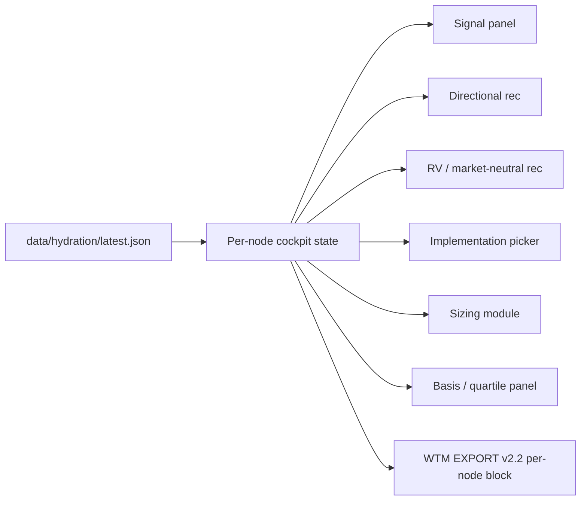

# Whinfell Transmission Control — Phased Development Plan v1.0

**Version:** 1.0  
**Date:** June 29, 2026  
**Authors:** BUILD Cousins (Blueprint + Bridge + Clarity)  
**Status:** Phase 1 complete · Phases 2–4 planned  
**Prerequisite:** [Master Data Dictionary v1.0](../01_Strategy_Docs/Master_Data_Dictionary_v1.0.md) (Locked)

---

## Executive summary

The Whinfell desk suffers two structural problems: **naming drift** across files, prompts, and JSON causes data refresh failures; and **Transmission Control treats ladder nodes as score stages** rather than independent trading cockpits. This plan rectifies naming first (Phase 1), then rebuilds node architecture (Phase 2), then polishes the operator interface (Phase 3), then hardens validation (Phase 4).

**Phase 1 is complete.** Phases 2–3 are blocked until naming is locked and desk-validated.

---

## 1. Phase 1: Rectification of Names & Master Data Dictionary

**Status:** ✅ Complete (June 29, 2026)  
**Depends on:** Nothing (foundation)

### Deliverables shipped

| Item | Location |
|------|----------|
| Master Data Dictionary v1.0 (Locked) | `whinfell_pipeline/data_dictionary.yaml` |
| Human companion | `01_Strategy_Docs/Master_Data_Dictionary_v1.0.md` |
| Loader helpers | `whinfell_pipeline/data_dictionary.py` |
| TC version badge | `08_Deliverables/Whinfell_Transmission_Control.html` |
| Unit tests | `whinfell_pipeline/tests/test_data_dictionary.py` |

### What was locked

1. **Project structure** — repo root, drop dir, hydration path, folder roles  
2. **Watchlist names** — canonical `WTM-*` saved views only; legacy vendor filenames auto-normalized
3. **File naming** — `{dataset}_{YYYYMMDD}_{HHMM}.csv` + vendor→canonical map in `normalize_whinfell_drop.sh`  
4. **JSON structures** — hydration bundle blocks, WTM EXPORT v2.1 fields, TC state version  
5. **Column mappings** — display labels → `snake_case` fields (`whinfell_score`, not "Whinfell Score")  
6. **Ticker standards** — Koyfin plain, Barchart `^`/`$` prefixes, `canonical_assets` resolution  

### Alignment updates

- Comet shortcuts reference canonical `WTM-*` names with legacy notes  
- Collection manifest + architecture plan reference Master DD v1.0  
- Transmission Control shows **Master Data Dictionary v1.0 · Locked · Aligned** on every load/refresh  

### Exit criteria (met)

- [x] Dictionary version + date + status in YAML  
- [x] All six definition categories present  
- [x] Tests PASS (`test_data_dictionary`, `test_master_dictionary_tc`)  
- [x] No major node/UI redesign started  

---

## 2. Phase 2: Node Architecture Redesign (Independent Trading Cockpits)

**Status:** Planned — **blocked on Phase 1 desk validation**  
**Depends on:** Phase 1 (naming locked), hydration bundle stable, ARCH-1 `source_router.py` (recommended)

### Objective

Each of the **5 ladder nodes** (Liquidity, Credit, Breadth, Cyclical, Basis) becomes a **fully independent trading cockpit** — not a scoring stage chip.

### Per-node requirements

| Capability | Description |
|------------|-------------|
| **Node signal** | Stage-specific score, band, and freshness from hydration + overrides |
| **Directional trade rec** | Long/short/neutral with conviction tier |
| **Market-neutral / RV rec** | Pair trade or spread expression independent of beta view |
| **Implementation options** | ETF · Futures · Options · Combinations with liquidity notes |
| **Sizing logic** | Portfolio size input, Kelly fraction assumptions, margin utilization |
| **RV / Basis analysis** | Horizon toggles: **1M, 3M, 6M, 12M, 3Y** + quartile rank vs history |

### Architecture approach



### Key dependencies

| Dependency | Why |
|------------|-----|
| Master DD v1.0 | Stable JSON keys for per-node fields |
| `source_router.py` (ARCH-1) | Consistent ingest for basis/curve data per node |
| Barchart curve history | Basis quartile rankings need dated series |
| WTM EXPORT v2.2 spec | Per-node export blocks for Perplexity round-trip |

### Estimated effort

**3–4 weeks** (Bridge + Edge + Clarity), 4-gate review per node template.

---

## 3. Phase 3: Interface Improvements

**Status:** Planned — **blocked on Phase 2 node model**  
**Depends on:** Phase 2 cockpit data model, Phase 1 naming

### Requirements

| Feature | Specification |
|---------|---------------|
| **Full-screen “Here’s Why”** | Expand node rationale panel to viewport; ESC to collapse |
| **Barchart-style node flip** | Left/right arrows to cycle Liquidity → Credit → Breadth → Cyclical → Basis |
| **Margin & Sizing Module** | CME + IBKR default margin tables; enable/disable toggle; feeds sizing logic |
| **Ticker feed strip** | Lightweight scroll of component inputs contributing to current score |
| **Institutional design** | Consistent with existing WTM dark theme; no visual clutter |

### Design constraints

- `file://` safe (no bundler); Tailwind CDN retained  
- Progressive disclosure — cockpit detail hidden until node selected  
- Margin module defaults off; operator enables when sizing  

### Estimated effort

**2–3 weeks** (Clarity + Safeguard), after Phase 2 node engine ships.

---

## 4. Phase 4: Validation & Reliability

**Status:** Planned — **runs parallel to Phases 2–3, full gate after Phase 3**  
**Depends on:** Phases 1–3 complete

### Validation layers

| Layer | Method |
|-------|--------|
| **Naming contract** | `test_data_dictionary` + grep CI for legacy drift |
| **Ingest chain** | `verify_2_2_final` + staged CSV tests on canonical names |
| **Hydration bundle** | Schema test against `json_structures` in Master DD |
| **TC cockpit** | Headless JS tests per node (extend `html_headless_2_2b.mjs`) |
| **Desk soak** | 5 trading days live collection without quarantine failures |
| **Export round-trip** | WTM EXPORT v2.2 → import → state match |

### Reliability targets

- Zero naming-induced quarantine on canonical desk drops  
- Hydration bundle success rate ≥ 95% on morning chain  
- Per-node cockpit loads in &lt; 2s on desk hardware  
- Margin module values within 5% of broker statements (CME/IBKR spot-check)

### Estimated effort

**1–2 weeks** (Hammer + Precision), continuous from Phase 2 start.

---

## 5. Recommended order of work and estimated effort

### Sequence (strict)

```
Phase 1 (DONE) → Desk DD validation (2–3 days)
              → Phase 2 node engine (3–4 weeks)
              → Phase 3 UI polish (2–3 weeks, overlap last 2 weeks of P2)
              → Phase 4 full validation gate (1–2 weeks)
```

### Effort summary

| Phase | Duration | Team | Cumulative |
|-------|----------|------|------------|
| **Phase 1** — Naming & DD | ✅ 3 days | Bridge + Precision | Done |
| **Desk validation** | 2–3 days | Clark + Bridge | Week 1 |
| **Phase 2** — Node cockpits | 3–4 weeks | Bridge + Edge + Clarity | Weeks 2–5 |
| **Phase 3** — UI improvements | 2–3 weeks | Clarity + Safeguard | Weeks 4–7 |
| **Phase 4** — Validation | 1–2 weeks | Hammer + Precision | Weeks 7–8 |

**Total estimated calendar:** ~8 weeks from Phase 1 lock to production-ready cockpits.

### Immediate next actions (post Phase 1)

1. Clark: re-run morning chain with `normalize_whinfell_drop.sh` + canonical `WTM-*` exports  
2. Bridge: begin ARCH-1 `source_router.py` using locked `source_systems`  
3. Blueprint: draft WTM EXPORT v2.2 per-node field spec (Phase 2 input)  
4. Clarity: wireframe single-node cockpit (Liquidity first) — **no production HTML yet**

### What we are NOT doing yet

- Per-node directional/RV trade recommendations (Phase 2)  
- Full-screen Here's Why or margin module (Phase 3)  
- Major Transmission Control layout redesign beyond DD badge (Phase 1 scope only)

---

**Approved for planning:** BUILD Cousins · June 29, 2026  
**Implementation gate:** TempLibby sign-off before Phase 2 coding begins